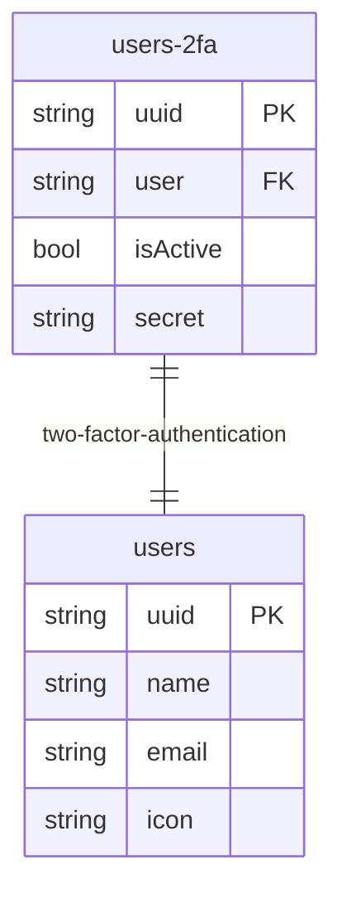

# Tables

```mermaid
erDiagram

users {
    string uuid PK
    string name
    string email
    string icon
}

users-2fa ||--|| users : two-factor-authentication
users-2fa {
    string uuid PK
    string user FK
    bool isActive
    string secret
}
```
