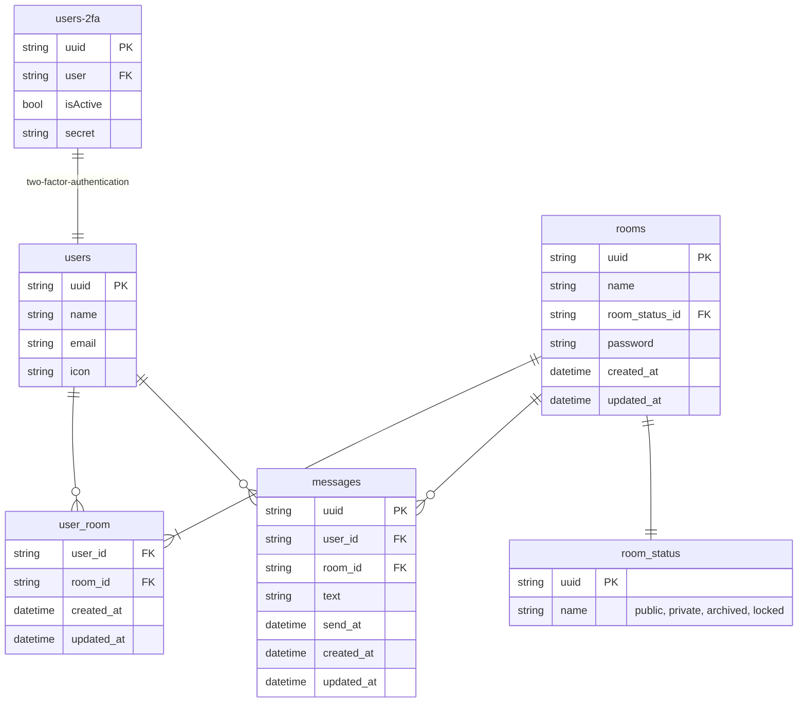

# Tables

```mermaid
erDiagram

users {
    string uuid PK
    string name
    string email
    string icon
}

users-2fa ||--|| users : two-factor-authentication
users-2fa {
    string uuid PK
    string user FK
    bool isActive
    string secret
}

rooms {
    string uuid PK
    string name
    string room_status_id FK
    string password
    datetime created_at
    datetime updated_at
}

room_status {
    string uuid PK
    string name "public, private, archived, locked"
}

user_room {
    string user_id FK
    string room_id FK
    datetime created_at
    datetime updated_at
}

messages {
    string uuid PK
    string user_id FK
    string room_id FK
    string text
    datetime send_at
    datetime created_at
    datetime updated_at
}

users ||--o{ user_room : ""
rooms ||--|{ user_room : ""
rooms ||--o{ messages : ""
users ||--o{ messages : ""
rooms ||--|| room_status : ""

```
